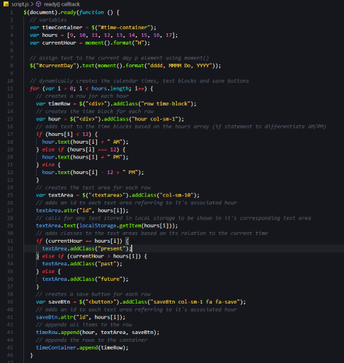

# WORK DAY SCHEDULER

The purpose of this repository is to create an application to help track and schedule your daily work activities.

-----

## Table of Contents
* [Installation](#installation)
* [Usage](#Usage)
* [Building the Scheduler](#building-the-scheduler)
* [Acceptance Criteria](#acceptance-criteria)
* [Credits](#credits)
* [Badges](#badges)
* [Links](#Links)
* [License](#license)

-----

## Installation
1. Follow the GitHub Repository Link in the [Links](#Links) section below.
1. Clone the repository using an SSH key.
1. Open GitBash and use "git clone" to clone the repository.

-----

## Usage
Edit using VSCode after [installation](#installation). HTML, JS and CSS files are provided.

#### Javascript

-----

## Building the Scheduler

Building this scheduler was actually a lot more simple than I initially thought it would be. If I didn't know it before, this assignment has definitely proven to me that everyone has a different coding style and you can do the same thing in a million different ways.

When using this scheduler, you will find that the date at the top of the page will automatically refresh to the current date. On the screen you will see dynamically generated rows for each hour of a standard business day. In each of these rows you will find an hour label, a text area and a save button. After entering text in the desired hour, you can then hit the save button of that row and your data will be saved in local storage for that row. You will find that after refreshing the page, your data will persist. You can clear your data by simply deleting your text and clicking save again. Another feature of this application is its dynamic styling. You will find that as the hours pass, they future hours will be colored green, the current hour will be red and previous hours will be gray.

-----

## Acceptance Criteria

* GIVEN I am using a daily planner to create a schedule :heavy_check_mark:
* WHEN I open the planner :heavy_check_mark:
* THEN the current day is displayed at the top of the calendar :heavy_check_mark:
* WHEN I scroll down :heavy_check_mark:
* THEN I am presented with timeblocks for standard business hours :heavy_check_mark:
* WHEN I view the timeblocks for that day :heavy_check_mark:
* THEN each timeblock is color coded to indicate whether it is in the past, present, or future :heavy_check_mark:
* WHEN I click into a timeblock :heavy_check_mark:
* THEN I can enter an event :heavy_check_mark:
* WHEN I click the save button for that timeblock :heavy_check_mark:
* THEN the text for that event is saved in local storage :heavy_check_mark:
* WHEN I refresh the page :heavy_check_mark:
* THEN the saved events persist :heavy_check_mark:

-----

## Credits
As always, a huge thanks to our instructional staff for all their hard work!

### Resources:

* [w3schools](https://www.w3schools.com)
* [Bootstrap CSS](https://getbootstrap.com/)
* [jQuery](https://jquery.com/)
* [Moment.js](https://momentjs.com/)

-----

## Badges

-----

## Links
[Repository Link](https://github.com/aimeecesler/work-day-scheduler)

[Deployed Application](https://aimeecesler.github.io/work-day-scheduler/)

-----

## License
Copyright &copy; [2020] [Aimee Corbin Esler]

Permission is hereby granted, free of charge, to any person obtaining a copy
of this software and associated documentation files (the "Software"), to deal
in the Software without restriction, including without limitation the rights
to use, copy, modify, merge, publish, distribute, sublicense, and/or sell
copies of the Software, and to permit persons to whom the Software is
furnished to do so, subject to the following conditions:

The above copyright notice and this permission notice shall be included in all
copies or substantial portions of the Software.

THE SOFTWARE IS PROVIDED "AS IS", WITHOUT WARRANTY OF ANY KIND, EXPRESS OR
IMPLIED, INCLUDING BUT NOT LIMITED TO THE WARRANTIES OF MERCHANTABILITY,
FITNESS FOR A PARTICULAR PURPOSE AND NONINFRINGEMENT. IN NO EVENT SHALL THE
AUTHORS OR COPYRIGHT HOLDERS BE LIABLE FOR ANY CLAIM, DAMAGES OR OTHER
LIABILITY, WHETHER IN AN ACTION OF CONTRACT, TORT OR OTHERWISE, ARISING FROM,
OUT OF OR IN CONNECTION WITH THE SOFTWARE OR THE USE OR OTHER DEALINGS IN THE
SOFTWARE.